## Đồ án môn học: Music Store Management - Hệ thống quản lí cửa hàng âm nhạc

### Lớp: 23CTT3
### Môn: Phương pháp lập trình hướng đối tượngtượng
### GVHD: Trần Duy Quang

## Thành viên nhóm
- 23120197 - Trà Văn Sỹ (Nhóm trưởng)
- 23120209 - Lê Hoàng Nhật Anh

## Các công việc mà từng thành viên đã thực hiện cho đến hiện tại
### Trà Văn Sỹ
- Xây dựng các class Model (Music, Order, User,...)

- Xây dựng các class liên quan đến Service cho các đối tượng (MusicService, OrderService,...) và các Controller cho từng role của User (admin/customer)

- Thiết kế các phần liên quan đến design pattern (Factory Pattern, Strategy Pattern) cho các đối tượng (Factory Pattern lựa chọn Controller phù hợp với role của user khi đăng nhập vào hệ thống, Strategy Pattern xử lí nhiều loại mã giảm giá khác nhau...)

- Soạn tài liệu với doxygen

### Lê Hoàng Nhật Anh
- Xây dựng các phương thức đọc/ghi dữ liệu trên database áp dụng MSSQL cho các kiểu dữ liệu khác nhau (Music, Order, User, Voucher...). Thiết kế class Factory cho ReadData và SaveData.

- Thiết kế các phần liên quan đến UI của toàn bộ chương trình (AdminUI, CustomerUI,...)

- Xây dựng các class xử lí bắt lỗi nhập liệu (InputValidator)

- Quay video demo

## Tỉ lệ đóng góp
- Trà Văn Sỹ: 100%
- Lê Hoàng Nhật Anh: 100%

## Tỉ lệ điểm: Chia đều

## Các mô tả cụ thể cho các yêu cầu trong phần "Cách thức đánh giá"

### Teamwork
[Báo cáo tiến độ hàng tuần](https://drive.google.com/file/d/1j_GBYkdf_Ny6QiK6zzkkofdpHIZHNRND/view?usp=sharing)

### UI/UX
### Các chức năng đã có của chương trình ban đầu:
- Thêm, xóa, chỉnh sửa các bài hát trong kho.
- Tìm nhạc theo các tiêu chí như tên, thể loại, ca sĩ...
- Tạo đơn hàng mua/bán các bài hát.
- Hiển thị số bài hát trong kho và các bài hát đã bán hết.  
[Mã nguồn tham khảo](https://www.codewithc.com/music-store-management-system-c-program-with-mysql-database/)

### Các chức năng mà nhóm đã cải tiến thêm
Nhóm đã phân tách ra 2 vai trò riêng biệt với 2 loại đối tượng người dùng riêng so với chương trình gốc chỉ đơn giản là mua/bán trên chung 1 giao diện

#### Tính năng dành cho người dùng (Customer)
- Đăng ký tài khoản mới: Người dùng có thể tạo tài khoản để sử dụng dịch vụ
- Đăng nhập: Truy cập vào hệ thống với tài khoản đã đăng ký
- Xem danh sách nhạc: Duyệt qua toàn bộ kho âm nhạc
- Tìm kiếm nhạc: Tìm kiếm bài hát theo tên, nghệ sĩ hoặc thể loại
- Quản lý giỏ hàng: Thêm, xóa các bài hát trong giỏ hàng
- Thanh toán đơn hàng: Hoàn tất quá trình mua nhạc
- Sử dụng mã giảm giá: Áp dụng các voucher giảm giá vào đơn hàng
- Xem lịch sử mua hàng: Kiểm tra các đơn hàng đã mua trước đó
- Nhận voucher khuyến mãi: Nhận mã giảm giá khi mua hàng với giá trị lớn
- Đăng xuất: Kết thúc phiên làm việc

#### Tính năng dành cho quản trị viên cửa hàng (Admin)
- Quản lý kho nhạc: Thêm, xóa, chỉnh sửa thông tin và giá bài hát
- Xem danh sách người dùng: Quản lý thông tin tài khoản khách hàng
- Quản lý tài khoản: Có quyền xóa tài khoản người dùng vi phạm
- Xem lịch sử đơn hàng: Kiểm tra toàn bộ đơn hàng trong hệ thống
- Thống kê doanh thu: Xem báo cáo doanh thu và số lượng bài hát đã bán
- Đăng xuất: Kết thúc phiên làm việc

#### Database: Áp dụng load/save data từ database với SQL Server thay vì đọc file thông thường

#### Hướng dẫn biên dịch chương trình
    + Nhập lệnh sau ở terminal:   
    ```g++ main.cpp AdminController.cpp AdminUI.cpp AuthService.cpp Cart.cpp CartService.cpp ControllerFactory.cpp CustomerController.cpp CustomerUI.cpp Discount.cpp DiscountService.cpp DiscountStrategy.cpp InputValidator.cpp Music.cpp MusicService.cpp Order.cpp OrderService.cpp ReadData.cpp SaveData.cpp Search.cpp SearchFactory.cpp StoreApp.cpp User.cpp UserService.cpp utils.cpp DatabaseConnector.cpp -lole32 -lodbc32 -o out/program```  
    để biên dịch chương trình
    + Nếu đã điều chỉnh trong .vscode/task.json thì chỉ cần gõ lệnh sau để biên dịch:
    ```g++ *.cpp -lole32 -lodbc32 -o out/program```

    + Nhập lệnh:
    ```./out/program``` để chạy chương trình.

### Kiến trúc phần mềm được áp dụng
Dự án được xây dựng theo mô hình kiến trúc nhiều lớp, có thể xem là biến thể của MVC (Model - View - Controller) kết hợp với Service Layer và Repository Pattern nhằm phân tách rõ ràng các thành phần của ứng dụng:

#### Model: Đại diện cho các thực thể dữ liệu của ứng dụng
- Các class như Music, Order, User, Voucher, Discount, Cart đại diện cho các đối tượng dữ liệu

#### View: Xử lí giao diện người dùng
- Được tách biệt thành các class UI riêng biệt (AdminUI, CustomerUI dựa trên console-based)
- Hiển thị thông tin và tương tác với người dùng mà không chứa logic nghiệp vụ

#### Controller: Xử lý các tương tác từ người dùng
- Các class Controller riêng biệt cho từng vai trò (AdminController, CustomerController), sử dụng Command Pattern để xử lí các action cho Menu chương trình.

#### Service Layer: Chứa bussiness logic
- Các class Music Service, UserService, OrderService, CartService, DiscountService, AuthService... chứa từng bussiness logic cụ thể cho các loại đối tượng khác nhau ở tầng Model.

#### Data Access Layer: Các lớp Repository (SqlMusicRepository, SqlUserRepository...) chịu trách nhiệm truy xuất dữ liệu cho từng loại model.

### Nguyên lí OOP được áp dụng
#### Tính đóng gói (Encapsulation)
- Các thuộc tính của class Model như Music, User, Order được khai báo private.
- Cung cấp các phương thức getter/setter để truy cập và thay đổi dữ liệu khi cần.
#### Tính kế thừa (Inheritance)
- Sử dụng kế thừa hiệu quả cho User (Admin, Customer), IController (AdminController, CustomerController), ISearch (NameSearch, ArtistSearch, GenreSearch), kế thừa các command cụ thể từ class Command interface, kế thừa từ interface cho các class về Repository...
#### Tính đa hình (Polymorphism)
- Được thể hiện rõ qua việc sử dụng các lớp cơ sở trừu tượng và interface như IController, ISearch, DiscountStrategy, Command, IRepository. Các đối tượng cụ thể được sử dụng thông qua con trỏ hoặc tham chiếu đến lớp cơ sở.
#### Tính trừu tượng (Abstraction)
- Các interface và lớp trừu tượng giúp định nghĩa các "hợp đồng" rõ ràng, che giấu chi tiết triển khai phức tạp.

### Tuân thủ các nguyên tắc SOLID
#### Single Responsibility Principle (SRP)
Mỗi class có một trách nhiệm duy nhất
- Các lớp Service (MusicService, UserService, OrderService, CartService,DiscountService, AuthService) chịu trách nhiệm cho các logic nghiệp vụ cụ thể.
- Các lớp Controller (AdminController, CustomerController) điều phối luồng giữa UI và Services.
- Các lớp UI (AdminUI, CustomerUI) chịu trách nhiệm hiển thị.
= Các lớp Repository chịu trách nhiệm truy cập dữ liệu.
- Các lớp Command đóng gói một hành động cụ thể cho menu chương trình.
#### Open/Closed Principle (OCP)
Code được thiết kế để mở rộng mà không cần sửa đổi
- Việc sử dụng Strategy Pattern (cho ISearch, DiscountStrategy) và Command Pattern cho phép dễ dàng thêm các chiến lược hoặc lệnh mới mà không cần sửa đổi nhiều code hiện có.
- Factory Pattern (áp dụng trên ControllerFactory, SearchFactory) cũng hỗ trợ nguyên tắc này.
#### Liskov Substitution Principle (LSP)
Các lớp con có thể thay thế lớp cha của chúng.
- Ví dụ: PercentageDiscountStrategy và FixedDiscountStrategy có thể thay thế cho DiscountStrategy, hay AdminController và CustomerController có thể được sử dụng ở bất cứ đâu gọi IController.
#### Interface Segregation Principle (ISP)
Sử dụng nhiều interface nhỏ, chuyên biệt thay vì interface lớn, phức tạp (Interface ISearch, IController, IRepository, Command) phục vụ cho các mục đích cụ thể
#### Dependency Inversion Principle (DIP)
- Các module cấp cao không phụ thuộc vào module cấp thấp mà phụ thuộc vào abstraction
- Ví dụ: sử dụng dependency injection trong các constructor của Controller và Service, lớp Discount phụ thuộc vào interface DiscountStrategy thay vì các lớp cụ thể

### Các Design Pattern được sử dụng
#### Factory Pattern
- ControllerFactory: Tạo AdminController hoặc CustomerController dựa trên Role.
- SearchFactory: Tạo các chiến lược tìm kiếm (NameSearch, ArtistSearch GenreSearch).
#### Strategy Pattern
- ISearch và các lớp con (NameSearch, ArtistSearch, GenreSearch): Cho phép thay đổi thuật toán tìm kiếm một cách linh hoạt.
- DiscountStrategy và các lớp con: Cho phép áp dụng các loại giảm giá khác nhau.
#### Command Pattern
CommandInvoker và các lớp kế thừa từ Command (ViewMusicListCommand, LoginCommand, v.v.) giúp đóng gói các hành động/yêu cầu từ menu chương trình thành đối tượng, tách rời người gọi yêu cầu khỏi người thực hiện yêu cầu. Điều này làm cho AdminController và CustomerController (2 class xử lí điều phối các hoạt động trên menu chương trình) trở nên gọn gàng hơn.
#### Repository Pattern
Các interface IRepository, IMusicRepository, IUserRepository, IOrderRepository, IDiscountRepository và các triển khai SQL (SqlMusicRepository,...) giúp tách biệt logic truy cập dữ liệu khỏi phần còn lại của ứng dụng.
#### Singleton Pattern
- Registry hoạt động như một Service Locator, cung cấp quyền truy cập toàn cục vào các service và repository.
- DatabaseConnector kết nối đến cơ sở dữ liệu SQLServer cũng được áp dụng singleton khởi tạo 1 kết nối xuyên suốt chương trình.

### Đảm bảo chất lượng (sẽ hoàn thành ở đợt nộp chính thức)

### Tài liệu mô tả kiến trúc phần mềm + Coding Convention
- Class Diagram (cài đặt Extension Markdown Preview Mermaid Support để hiển thị)

```mermaid
classDiagram
    %% Abstract Classes and Interfaces
    class IUser {
        <<abstract>>
        -id: int
        -username: string
        -password: string
        +IUser(username, password)
        +getRole(): string
        +getUsername(): string
        +getPassword(): string
        +toString(): string
        +~IUser()
    }
    
    class IController {
        <<abstract>>
        +menu(vector~Music~, vector~shared_ptr~IUser~~, vector~Order~, vector~shared_ptr~Discount~~, shared_ptr~IUser~): void
    }
    
    class ISearch {
        <<interface>>
        +search(vector~Music~, string): vector~Music~
    }
    
    class IReadData~T~ {
        <<interface>>
        +readData(): vector~T~
    }
    
    class ISaveData~T~ {
        <<interface>>
        +saveData(vector~T~): void
    }
    
    class DiscountStrategy {
        <<interface>>
        +calculateDiscount(float): float
    }
    
    %% Model Classes
    class Music {
        -id: int
        -name: string
        -artist: string
        -genre: string
        -price: float
        -quantity: int
        +Music(id, name, artist, genre, price, quantity)
        +getId(): int
        +getName(): string
        +getArtist(): string
        +getGenre(): string
        +getPrice(): float
        +getQuantity(): int
        +setName(string): void
        +setArtist(string): void
        +setGenre(string): void
        +setPrice(float): void
        +setQuantity(int): void
    }
    
    class Order {
        -username: string
        -purchasedItems: vector~Music~
        -total: float
        +Order(username, items, total)
        +getUsername(): string
        +getPurchasedItems(): vector~Music~
        +getTotal(): float
    }
    
    class Admin {
        +Admin(username, password)
        +getRole(): string
    }
    
    class Customer {
        +Customer(username, password)
        +getRole(): string
    }
    
    class Cart {
        -items: vector~Music~
        +addItem(Music): void
        +removeItem(int): void
        +getItems(): vector~Music~
        +clear(): void
        +calculateTotal(): float
    }
    
    class Discount {
        -code: string
        -username: string
        -strategy: shared_ptr~DiscountStrategy~
        +Discount(code, username, strategy)
        +apply(float): float
        +getCode(): string
        +getUsername(): string
    }
    
    %% Service Classes
    class MusicService {
        +addMusic(Music): void
        +getMusic(int): Music
        +updateMusic(Music): void
        +deleteMusic(int): void
        +getAllMusic(): vector~Music~
        +searchMusic(string, string): vector~Music~
    }
    
    class OrderService {
        +createOrder(string, vector~Music~, float): void
        +getUserOrders(vector~Order~, string): vector~Order~
        +getAllOrders(): vector~Order~
    }
    
    class UserService {
        +addUser(shared_ptr~IUser~): void
        +getUser(string): shared_ptr~IUser~
        +deleteUser(string): void
        +getAllUsers(): vector~shared_ptr~IUser~~
    }
    
    class DiscountService {
        +addDiscount(shared_ptr~Discount~): void
        +getUserDiscounts(vector~shared_ptr~Discount~~, string): vector~shared_ptr~Discount~~
        +applyDiscount(string, float): float
    }
    
    class CartService {
        -cart: Cart
        +addToCart(Music): void
        +removeFromCart(int): void
        +getCartItems(): vector~Music~
        +clearCart(): void
        +calculateTotal(): float
    }
    
    class Authentication {
        +register(string, string, string): bool
        +login(string, string): shared_ptr~IUser~
    }
    
    %% Controllers
    class AdminController {
        -musicService: MusicService&
        -userService: UserService&
        -orderService: OrderService&
        +AdminController(MusicService&, UserService&, OrderService&)
        +menu(vector~Music~, vector~shared_ptr~IUser~~, vector~Order~, vector~shared_ptr~Discount~~, shared_ptr~IUser~): void
        -handleMusicManagement(vector~Music~): void
        -handleUserManagement(vector~shared_ptr~IUser~~): void
        -handleOrderHistory(vector~Order~): void
        -handleSalesStatistics(vector~Order~): void
    }
    
    class CustomerController {
        -musicService: MusicService&
        -cartService: CartService&
        -orderService: OrderService&
        -discountService: DiscountService&
        +CustomerController(MusicService&, CartService&, OrderService&, DiscountService&)
        +menu(vector~Music~, vector~shared_ptr~IUser~~, vector~Order~, vector~shared_ptr~Discount~~, shared_ptr~IUser~): void
        -handlePurchaseHistory(vector~Order~, Customer*&): void
        -handleMusicList(vector~Music~): void
        -handleSearch(vector~Music~): void
        -handleAddToCart(vector~Music~, Cart&): void
        -handleRemoveFromCart(Cart&, vector~Music~): void
        -handleCheckout(vector~Order~, vector~Music~, Cart&, vector~shared_ptr~Discount~~, Customer*&): void
        -handleLogout(Cart&, shared_ptr~IUser~&): bool
    }
    
    class ControllerFactory {
        -musicService: MusicService&
        -cartService: CartService&
        -orderService: OrderService&
        -discountService: DiscountService&
        -userService: UserService&
        +ControllerFactory(MusicService&, CartService&, OrderService&, DiscountService&, UserService&)
        +createController(string): shared_ptr~IController~
    }
    
    %% UI Classes
    class AdminUI {
        +displayWelcomeMessage(string): void
        +displayMenu(): void
        +displayMusicList(vector~Music~&): void
        +displayUserList(vector~shared_ptr~IUser~~&): void
        +displayPurchasedHistory(Order&, int): void
        +displaySaleStatistics(vector~pair~string,pair~int,float~~~&): void
        +getNewMusicDetails(): Music
    }
    
    class CustomerUI {
        +displayWelcomeMessage(string): void
        +displayMenu(): void
        +displayMusicList(vector~Music~&): void
        +displayCart(vector~Music~&): void
        +displayPurchasedHistory(vector~Order~&, string): void
        +getMusicSearchType(): int
        +getMusicSearchQuery(): string
    }
    
    %% Utility Classes
    class SearchFactory {
        +createSearchStrategy(string): shared_ptr~ISearch~
    }
    
    class NameSearch {
        +search(vector~Music~, string): vector~Music~
    }
    
    class ArtistSearch {
        +search(vector~Music~, string): vector~Music~
    }
    
    class GenreSearch {
        +search(vector~Music~, string): vector~Music~
    }
    
    class ReadDataFactory~T~ {
        +createReader(string): shared_ptr~IReadData~T~~
    }
    
    class SaveDataFactory~T~ {
        +createSaver(string): shared_ptr~ISaveData~T~~
    }
    
    class DatabaseConnector {
        -connection: SQLHDBC
        -environment: SQLHENV
        -connectionString: string
        +connect(): bool
        +disconnect(): void
        +executeQuery(string): bool
        +fetchResults(): vector~vector~string~~
    }
    
    class PercentageDiscountStrategy {
        -percentage: float
        +PercentageDiscountStrategy(float)
        +calculateDiscount(float): float
    }
    
    class FixedDiscountStrategy {
        -amount: float
        +FixedDiscountStrategy(float)
        +calculateDiscount(float): float
    }
    
    class InputValidator {
        +validateInt(string): pair~bool,int~
        +validateFloat(string): pair~bool,float~
        +validateString(string): pair~bool,string~
    }
    
    class StoreApp {
        -items: vector~Music~
        -users: vector~shared_ptr~IUser~~
        -orders: vector~Order~
        -vouchers: vector~shared_ptr~Discount~~
        -auth: Authentication
        -musicService: MusicService
        -userService: UserService
        -orderService: OrderService
        -cartService: CartService
        -discountService: DiscountService
        -controllerFactory: ControllerFactory
        +StoreApp()
        +run(): void
        -handleSignUp(): void
        -handleLogin(shared_ptr~IUser~&): bool
        -loadData(): void
        -saveData(): void
    }
    
    %% Relationships
    IUser <|-- Admin
    IUser <|-- Customer
    IController <|-- AdminController
    IController <|-- CustomerController
    ISearch <|-- NameSearch
    ISearch <|-- ArtistSearch
    ISearch <|-- GenreSearch
    DiscountStrategy <|-- PercentageDiscountStrategy
    DiscountStrategy <|-- FixedDiscountStrategy
    
    AdminController --> AdminUI 
    CustomerController --> CustomerUI 
    
    ControllerFactory --> AdminController
    ControllerFactory --> CustomerController 
    
    SearchFactory --> NameSearch 
    SearchFactory --> ArtistSearch 
    SearchFactory --> GenreSearch 
    
    StoreApp --> ControllerFactory 
    StoreApp --> Authentication 
    StoreApp --> MusicService 
    StoreApp --> UserService 
    StoreApp --> OrderService 
    StoreApp --> CartService 
    StoreApp --> DiscountService 
    
    Discount --> DiscountStrategy 
    
    AdminController --> MusicService 
    AdminController --> UserService 
    AdminController --> OrderService 
    
    CustomerController --> MusicService 
    CustomerController --> CartService 
    CustomerController --> OrderService 
    CustomerController --> DiscountService 
    
    MusicService --> Music 
    OrderService --> Order 
    UserService --> IUser 
    CartService --> Cart 
    DiscountService --> Discount 
```

    
- [Tài liệu mô tả (tạo bằng Doxygen, chứa trong thư mục references)](references/html/index.html)

- [Tài liệu Coding Convention](https://docs.google.com/document/d/10KNVaHAwrnSvY9fQ1v7uBX2IVxCTLYYALBpOFh5hXmo/edit?tab=t.0)


### Video demo mô tả:
https://youtu.be/7A5fEKxOeRI?si=2_lJkSKKqz_AJuZ-

